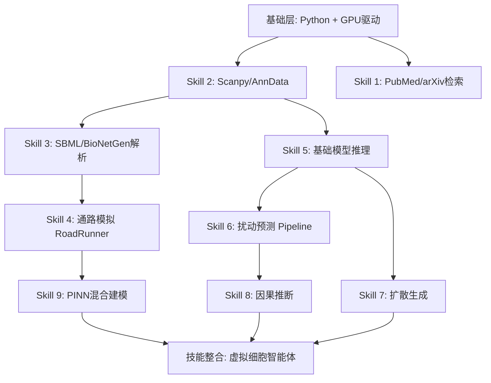

# 🧬 虚拟细胞智能体 Skill 矩阵

> 基于 2026 年深度调研，提炼构建"虚拟细胞智能体"所需的核心技能。
> 覆盖：知识检索 → 数据解析 → 建模仿真 → AI模型推理 → 可视化 → 工作流编排

---

## 一、总览矩阵

| # | 技能名称 | 子领域 | 底层技术/库 | 实现难度 | 所需工具 | 开源状态 |
|---|---------|--------|------------|---------|---------|---------|
| 1 | **文献检索与知识挖掘** | 知识检索 | BioPython Entrez / arXiv API / Semantic Scholar API | ⭐⭐ | Python + API Key | ✅ 全开源 |
| 2 | **单细胞数据解析** | 数据解析 | Scanpy + AnnData / Seurat (R) / scVI | ⭐⭐ | Python 3.10+ | ✅ 全开源 |
| 3 | **SBML/SBGN 网络解析** | 数据解析 | libSBML / BioNetGen / PySB | ⭐⭐⭐ | Python + libSBML | ✅ 全开源 |
| 4 | **细胞通路模拟** | 仿真预测 | Tellurium (RoadRunner) / COPASI / VCell | ⭐⭐⭐ | Python / Java | ✅ 全开源 |
| 5 | **AI 基础模型推理** | 模型推理 | HuggingFace Transformers / PyTorch | ⭐⭐⭐ | GPU / HF Token | ✅ 开源权重 |
| 6 | **扰动响应预测** | 仿真预测 | scGPT / Geneformer / AlphaCell (待开源) | ⭐⭐⭐⭐ | GPU 24GB+ | ⚠️ 部分开源 |
| 7 | **扩散生成模型** | 生成建模 | Lingshu-Cell / X-Cell (待开源) / Diffusers | ⭐⭐⭐⭐ | GPU 48GB+ | ⚠️ 部分可用 |
| 8 | **因果推断与解释** | 可解释性 | CausCell 方法 / SCM + Diffusion 框架 | ⭐⭐⭐⭐⭐ | 自定义实现 | 🔬 论文级别 |
| 9 | **物理信息神经网络** | 混合建模 | Physics-Informed Neural Networks (PINNs) | ⭐⭐⭐⭐ | PyTorch / TensorFlow | ✅ 通用库 |
| 10 | **知识图谱构建** | 数据整合 | Neo4j / NetworkX / BioPAX | ⭐⭐⭐ | 图数据库 | ✅ 全开源 |
| 11 | **空间组学分析** | 多模态融合 | Squidpy / SpaGCN / Giotto | ⭐⭐⭐ | Python | ✅ 全开源 |
| 12 | **自动化实验闭环** | 工作流编排 | Airflow / Prefect / 实验室机器人 API | ⭐⭐⭐⭐⭐ | 定制集成 | ⚠️ 商业主导 |
| 13 | **多智能体编排** | Agent 架构 | LangGraph / CrewAI / AutoGen | ⭐⭐⭐ | Python | ✅ 全开源 |

---

## 二、Skill 详细技术规范

### Skill 1：文献检索与知识挖掘

**用途**：从 PubMed、arXiv、Semantic Scholar 等渠道自动检索虚拟细胞相关论文，提取核心发现并总结。

**技术栈**：
```python
# 核心依赖
pip install biopython arxiv semantic-scholar-api requests html2text

# PubMed 检索
from Bio import Entrez
Entrez.email = "your@email.com"
handle = Entrez.esearch(db="pubmed", term="virtual cell AI foundation model", retmax=20)

# arXiv 检索
import arxiv
search = arxiv.Search(query="virtual cell perturbation prediction", max_results=20)

# Semantic Scholar + 提取结构化摘要
import requests
r = requests.get("https://api.semanticscholar.org/graph/v1/paper/search",
                 params={"query": "AlphaCell virtual cell world model", "limit": 10})
```

**关键 API 端点**：
| 来源 | API | 限额 |
|------|-----|------|
| PubMed | E-utilities (REST) | 无密钥 3 req/s，有密钥 10 req/s |
| arXiv | api.arxiv.org | 无硬限，建议 1 req/s |
| Semantic Scholar | api.semanticscholar.org | 100 req/min（无密钥） |
| Europe PMC | api.europepmc.org | 无限制 |

**输出规范**：Markdown 结构化摘要（标题/期刊/年份/核心贡献/引用链接），用于输入到下游 RAG 管道。

---

### Skill 2：单细胞数据解析（Scanpy + AnnData）

**用途**：处理单细胞转录组/多组学数据，作为虚拟细胞模型的输入预处理层。

**技术栈**：
```python
pip install scanpy[leiden] anndata scipy pandas matplotlib

import scanpy as sc

# 读取 10X 标准输出
adata = sc.read_10x_h5("filtered_feature_bc_matrix.h5")

# QC → 标准化 → 高变基因 → PCA → UMAP → Leiden 聚类
sc.pp.filter_cells(adata, min_genes=200)
sc.pp.filter_genes(adata, min_cells=3)
sc.pp.normalize_total(adata, target_sum=1e4)
sc.pp.log1p(adata)
sc.pp.highly_variable_genes(adata, n_top_genes=2000)
sc.pp.pca(adata)
sc.pp.neighbors(adata)
sc.tl.umap(adata)
sc.tl.leiden(adata)
```

**关键数据结构**：
```python
# AnnData 对象结构
adata.X       # 表达矩阵 (cell × gene)
adata.obs     # 细胞元数据 (DataFrame)
adata.var     # 基因元数据 (DataFrame)
adata.obsm    # 细胞嵌入 (PCA, UMAP 等)
adata.layers  # 多层表达数据（原始/归一化/批次校正）
```

**集成路径**：Scanpy 输出 → AnnData → scGPT/Geneformer 需要的 tokenized 格式 → 模型推理。

---

### Skill 3：SBML / BioNetGen 网络解析

**用途**：读取、解析和操作 SBML（系统生物学标记语言）和 BioNetGen 格式的生化网络模型。

**技术栈**：
```python
# SBML 解析 (C++ 底层, Python 绑定)
pip install python-libsbml  # 最新版 5.20.5 (2026.02)

import libsbml
reader = libsbml.SBMLReader()
doc = reader.readSBML("model.sbml")
model = doc.getModel()

# 遍历物种、反应、参数
for s in model.getListOfSpecies(): print(s.getId(), s.getInitialConcentration())
for r in model.getListOfReactions(): print(r.getId(), r.getReactants(), r.getProducts())

# BioNetGen 解析
pip install biosimulators_bionetgen  # v0.1.7
# 或使用 PySB (Python 原生规则建模)
pip install pysb
from pysb import Model, Monomer, Parameter, Rule
# PySB 可以直接用 Python 语法定义生化规则并输出为 SBML

# 从网络数据中提取核心拓扑特征
import networkx as nx
G = nx.DiGraph()
for r in model.getListOfReactions():
    for reactant in r.getListOfReactants():
        for product in r.getListOfProducts():
            G.add_edge(reactant.getSpecies(), product.getSpecies())
```

**关键工具对比**：

| 工具 | 格式 | 语言绑定 | 适用场景 |
|------|------|---------|---------|
| libSBML | SBML (L2/L3) | C++, Python, Java, C# | 解析/写入/验证 SBML 的标准工具 |
| BioNetGen | BNGL | CLI, Python | 基于规则的建模，大规模组合复杂性 |
| PySB | Python DSL | Python | 用 Python 定义生化反应规则，导出 SBML |
| Biosimulators | SBML/BNGL | Python (云端) | 跨平台统一仿真接口 |

**陷阱提示**：
- SBML Level 3 的 `fbc`（通量平衡）扩展包需要额外解析
- BioNetGen 规则数量极大时可生成数百万 ODE，需注意内存
- PySB 目前对 SBML Level 3 多扩展包支持不完全

---

### Skill 4：细胞通路模拟（开源 API）

**用途**：对解析后的生化网络模型进行数值仿真（ODE / 随机 / 空间）。

**技术栈**：
```python
# Tellurium + RoadRunner (JIT 编译, 高性能)
pip install tellurium  # 内含 libRoadRunner

import tellurium as te

# 从 SBML 或 Antimony (人类可读格式) 加载模型
r = te.loada("""
    // Antimony 格式：反应式
    S1 -> S2; k1*S1
    S2 -> S3; k2*S2
    S1 = 10; S2 = 0; S3 = 0
    k1 = 0.5; k2 = 0.3
""")

# 模拟并绘图
result = r.simulate(0, 10, 100)  # 0-10 时间单位, 100 个时间点
te.plot(result)

# 调用 API 方式（可包装为服务）
import roadrunner
rr = roadrunner.RoadRunner("model.sbml")
data = rr.simulate(0, 10, 100)
```

**可用工具矩阵**：

| 工具 | 语言 | 仿真类型 | API 友好度 | 典型速度 | 开源 |
|------|------|---------|-----------|---------|------|
| **RoadRunner** | C++/Python | ODE/随机 | ⭐⭐⭐⭐⭐ | 最快（JIT） | MIT |
| **COPASI** | C++/Python | ODE/随机/稳态 | ⭐⭐⭐ | 快 | Artistic |
| **VCell** | Java/Python | PDE/ODE/随机/空间 | ⭐⭐⭐ | 中（含空间） | GPL |
| **AMICI** | C++/Python | ODE + 灵敏度和贝叶斯 | ⭐⭐⭐⭐ | 快 | BSD |
| **BioSimulators** | Python (云) | 统一调用以上所有 | ⭐⭐⭐⭐⭐ | 取决于后端 | MIT |

**关键 API 封装示例（BioSimulators 统一接口）**：
```python
pip install biosimulators-utils

from biosimulators_utils.simulator.exec import exec_simulator
# 统一调用：提交 SBML + 仿真参数，自动调度到 RoadRunner/COPASI/VCell
```

---

### Skill 5：AI 基础模型推理

**用途**：在本地或云端运行 scGPT、Geneformer 等单细胞基础模型。

**技术栈**：
```python
# Geneformer (HuggingFace)
pip install transformers datasets torch

from transformers import AutoModel, AutoTokenizer
model = AutoModel.from_pretrained("ctheodoris/Geneformer")  # 12-layer transformer
# 输入：基因表达排序的 token 序列
# 输出：细胞级嵌入（用于下游分类/预测）

# scGPT (GitHub)
pip install scgpt
import scgpt as scg
model = scg.SCGPT.from_pretrained("scgpt/scgpt")  # 3300万细胞预训练
# 输入：基因表达向量
# 输出：细胞嵌入 + 扰动预测

# HuggingFace Inference API
import requests
API_URL = "https://api-inference.huggingface.co/models/ctheodoris/Geneformer"
headers = {"Authorization": "Bearer hf_xxxx"}
response = requests.post(API_URL, headers=headers, json={"inputs": cell_input})
```

**硬件需求**：

| 模型 | 参数量 | 推理 GPU | 微调 GPU | 存储 | 开源 |
|------|-------|---------|---------|------|------|
| Geneformer | ~15M | T4 (8GB) | A10 (24GB) | ~500MB | ✅ MIT |
| scGPT | ~100M | T4 (8GB) | A10 (24GB) | ~1.5GB | ✅ MIT |
| Lingshu-Cell | ~650M | A10 (24GB) | A100 (40GB) | ~5GB | ⚠️ 预印本 |
| AlphaCell | ~1.2B (decoder) | A10 (24GB) | A100 (80GB) | ~10GB | 🔬 待开源 |
| X-Cell | 4.9B | A100 (40GB) | H100 | ~40GB | ❌ 商业 |

---

### Skill 6：扰动响应预测 Pipeline

**用途**：预测基因敲除/药物处理后的全基因组表达变化，这是虚拟细胞的核心任务。

**技术栈**：
```python
# 方案 A：scGPT 扰动预测
import scgpt as scg
model = scg.SCGPT.from_pretrained("scgpt/scgpt-perturb")
# 输入：对照细胞 + 目标基因/药物 ID
prediction = model.predict_perturbation(ctrl_cells, target_gene="TP53")

# 方案 B：GEARS (图神经网络 + 知识图谱)
pip install gears
from gears import GEARS
model = GEARS(pert_data)  # 需要预处理后的扰动数据
# 预测双基因组合扰动

# 方案 C：简单基线 — 比复杂模型更强
import numpy as np
# "加性模型"预测双基因 KO = 单基因 KO1 效应 + 单基因 KO2 效应
# 这竟然超过了 scGPT/Geneformer (2025 基准测试实证)
```

**关键洞察 — 为什么简单基线常常胜出**：

```
复杂模型预测 > 加性模型 > 平均值基线 > "无变化"基线
      ↓              ↓            ↓            ↓
  性能最差      表现最好       稳健次优    最强鲁棒性
```

这意味着虚拟细胞智能体必须**内建验证机制**：在运行复杂模型之前，先计算简单基线对比。

---

### Skill 7-13：补充技能速览

| Skill | 一句话用途 | 推荐工具 |
|-------|-----------|---------|
| **扩散生成模型** | 生成新细胞状态（虚拟细胞创造） | 🤗 Diffusers + Lingshu-Cell 代码 |
| **因果推断与解释** | 用 SCM 拆解细胞状态的因果驱动因子 | CausCell 论文复现 / DoWhy |
| **物理信息神经网络** | 在神经网络中嵌入生物物理定律 | PyTorch + PINN 框架 / DeepXDE |
| **知识图谱构建** | 整合通路/蛋白互作/基因调控先验知识 | Neo4j + BioPAX 解析器 |
| **空间组学分析** | 融合空间位置信息的细胞图谱分析 | Squidpy / SpaGCN / stLearn |
| **自动化实验闭环** | AI 预测 → 机器人实验验证 → 模型迭代 | Airflow + 实验室自动化 SDK |
| **多智能体编排** | 编排以上所有 Skill 的 Agent 框架 | LangGraph / CrewAI / AutoGen |

---

## 三、推荐 Skill 安装顺序（从易到难）



**推荐起步路径**（1-2 周可搭建原型）：

1. 安装 Scanpy + AnnData（单细胞数据分析基础）
2. 安装 Tellurium/RoadRunner（通路仿真）
3. 配置 HuggingFace + Geneformer/scGPT 推理
4. 搭建简单的扰动预测 Pipeline（含简单基线对比）
5. 集成文献检索模块（BioPython Entrez + arXiv）
6. 用 LangGraph 将以上编排为统一智能体

---

## 四、关键陷阱与经验总结

### 🚨 陷阱 1：复杂模型 ≠ 更好
基准测试反复验证：在扰动预测任务中，**加性模型**（即双基因扰动 = 两单基因效应之和）常常优于 scGPT 和 Geneformer。建议智能体在运行大模型前**先计算简单基线**，只有当复杂模型显著优于基线时才使用其预测。

### 🚨 陷阱 2：数据缩放定律失效
单细胞领域的数据缩放定律有条件性成立。增加模型参数而不升级数据质量不会自动提升性能。智能体应在训练/微调前评估 `数据-参数比`。

### 🚨 陷阱 3：干预数据 > 观测数据
绝大多数公开数据集是观测性（静态图谱）的，但真正支撑虚拟细胞预测的是干预性数据（Perturb-seq）。智能体在搜索文献时应优先标注包含干预数据的论文。

### 🚨 陷阱 4：SBML 版本兼容
SBML L3 有 30+ 扩展包（fbc, qual, comp, distrib 等）。不同仿真工具支持的扩展包不一致。建议统一通过 BioSimulators 做层抽象。

### 🚨 陷阱 5：GPU 显存规划
| 任务 | 最低显存 | 推荐显存 |
|------|---------|---------|
| scGPT/Geneformer 推理 | 8 GB | 16 GB |
| Lingshu-Cell 推理 | 24 GB | 40 GB |
| X-Cell 推理 | 40 GB | 80 GB |
| 模型微调 | 24 GB | 80 GB |

---

## 五、智能体架构建议

```python
# 虚拟细胞智能体核心调度伪代码

class VirtualCellAgent:
    def __init__(self):
        self.skills = {
            "retrieve": PubMedRetriever(),
            "parse": SBMLParser(),
            "simulate": BioSimulator(),
            "predict": FoundationModelInferer(),
            "baseline": SimpleBaseline(),
            "explain": CausalExplainer(),
        }

    def analyze_perturbation(self, target_gene, cell_type):
        # Step 1: 检索相关文献
        papers = self.skills["retrieve"].search(f"{target_gene} {cell_type} perturbation")

        # Step 2: 计算简单基线
        baseline = self.skills["baseline"].run(target_gene)

        # Step 3: 运行 AI 模型推理
        ai_pred = self.skills["predict"].predict(target_gene, cell_type)

        # Step 4: 验证 AI 模型是否优于基线
        if ai_pred.improves_upon(baseline):
            result = ai_pred
        else:
            result = baseline  # 回退到简单基线

        # Step 5: 因果解释
        explanation = self.skills["explain"].interpret(result)

        return {"prediction": result, "evidence": papers, "explanation": explanation}
```

---

> **版本**：v1.0 · 2026.06 · 基于深度研究报告生成
> **下一步**：可按任一 Skill 展开为独立的 Skill 实现文件（含安装脚本 + 测试用例）
